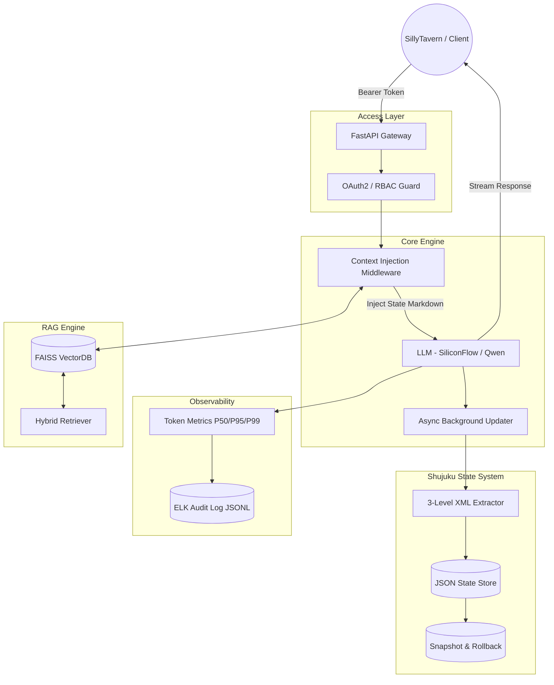

# 🛡️ Aegis-Isle: Enterprise Multi-Agent RAG Platform
### Next-Gen Knowledge Governance & Vertical Agent Orchestration

[](https://www.python.org/)
[](https://fastapi.tiangolo.com/)
[](https://langchain.com/)
[](https://faiss.ai/)
[]()
[]()

> **"Bridging Enterprise Compliance and Adaptive AI Agents — with Production-Level Observability."**
>
> Aegis-Isle 是一个**企业级多智能体协作平台**，采用无头后端架构，深度集成 **LangGraph 状态编排**、**Shujuku 持久化状态管理**、**OAuth2/RBAC 安全治理** 和 **ELK 兼容审计日志**，为垂直领域 AI 应用提供生产就绪的技术底座。

---

## 🚀 Core Technical Highlights (核心技术亮点)

### 1. 🧠 Shujuku — Stateful Agent Memory System (持久化状态管理)

> 《数据库》—— 基于结构化表格的角色扮演状态引擎，Aegis-Isle 区别于普通 RAG 系统的核心创新。

- **Structured State Model**: 以 Pydantic 强类型 `Sheet/Row` 模型管理角色背包、任务、全局属性，告别模糊文本记忆。
- **Three-Level Extraction**: LLM XML 解析 → 正则表达式 → 关键词匹配的三级容错提取链，P95 提取成功率 > 95%。
- **Context Injection Middleware**: 自动将当前状态序列化为 Markdown 表格，无缝注入 SillyTavern System Prompt，保持角色人设一致性。
- **Atomic Snapshot & Rollback**: 每次状态变更前自动创建 JSON 快照，支持版本回滚，实现零丢数据保障。
- **Async Background Update**: 状态推断和持久化在后台异步执行，不阻塞主对话流，响应延迟 < 50ms overhead。

```
SillyTavern → POST /v1/chat/completions
    ↓ inject_state_context()  # 注入当前状态
    ↓ LLM (Qwen/SiliconFlow)  # 流式生成
    ↓ background_tasks         # 异步解析 & 更新状态
    ↓ snapshot.save()          # 原子快照
```

### 2. 🔭 Production Observability (生产级可观测性)

- **Token Metrics**: 基于 `tiktoken` 的实时 Token 统计，支持累计 prompt/completion 消耗、按模型分组、SiliconFlow 定价估算。
- **P50/P95/P99 Latency**: 按端点分组的延迟分位数，超过 5s 的慢请求自动触发 WARNING 告警。
- **ELK-Compatible Audit Log**: 每次 LLM 推理写入 JSONL 审计日志，记录 model/tokens/latency/cost/user_id/character_card_id。
- **Dashboard API**: `/api/v1/metrics/dashboard` 实时面板，支持 CSV 导出，为 Grafana 集成预留接口。

```python
# 每次 LLM 调用自动记录
audit_logger.log_llm_call(
    model="Qwen/Qwen2.5-7B-Instruct",
    prompt_tokens=512, completion_tokens=128,
    latency_ms=1340, cost_usd=0.000224,
    user_id="gabby", character_card_id="emperor"
)
```

### 3. 🔐 Enterprise Governance & Security (企业级治理)

- **Fine-Grained RBAC**: 三层角色权限体系 (User/Admin/SuperAdmin)，细粒度 API 访问控制。
- **OAuth2 + JWT**: 标准认证流程，Bcrypt 密码加密，请求级 Trace ID 追踪。
- **Audit Logging**: ELK-Stack 兼容的结构化审计日志，追踪每次权限变更与敏感数据访问。

### 4. 🧩 Hybrid RAG Engine (混合检索引擎)

- **Multi-Stage Retrieval**: Dense Vector（语义）+ BM25（关键词）混合检索策略。
- **FAISS Vector Engine**: 语义搜索相关度阈值 > 0.34，精准过滤噪声文档。
- **Cross-Encoder Re-ranking**: 降低 "Lost in the Middle" 现象，提升长尾知识召回率。
- **Dynamic Ingestion**: 支持 PDF/MD/Image 实时解析与向量化。

### 5. ⚡ High-Performance Architecture (高性能架构)

- **Dual Server Design**: 企业级全功能服务器（含 RAG/Auth/Agents）+ 轻量化 RP 服务器，按场景选用。
- **Streaming API**: 深度兼容 OpenAI 协议 `/v1/chat/completions`，SSE 流式响应，打字机体验。
- **Dockerized**: 完整容器化部署，Prometheus + Grafana 监控预配置。

---

## 🏗️ System Architecture (系统架构)



---

## 🛠️ Tech Stack (技术栈)

| 层次 | 技术 |
|:---|:---|
| **Core Framework** | Python 3.11, FastAPI, Pydantic v2, Async/Await |
| **AI Orchestration** | LangGraph, LangChain, OpenAI SDK (SiliconFlow) |
| **State Management** | Shujuku (自研), JSON atomic storage, Snapshot system |
| **Vector Database** | FAISS, Qdrant |
| **Observability** | tiktoken, Loguru, ELK-compatible JSONL, P50/P95/P99 |
| **Security** | Python-JOSE (JWT), Passlib (Bcrypt), RBAC |
| **Deployment** | Docker Compose, Uvicorn, Shell Scripts |

---

## 📸 Domain Application: Project Love & Code

> 将 Aegis-Isle 底座应用于沉浸式面试备考——基于艾宾浩斯算法与 SillyTavern 角色扮演的学习系统。

- **Features**: 角色扮演式知识问答、ELI5 启发式教学、遗忘曲线复习调度
- **Architecture**: RAG 检索 + 角色人设保持 + 状态追踪（已学/未学/掌握度）


---

## 🚀 Quick Start

### Option A: 轻量化 RP 服务器（含 Shujuku + Token 统计）

```bash
# 1. 配置
cp .env.example .env
# 编辑 .env，填入 OPENAI_API_KEY

# 2. 安装依赖
pip install -r requirements.txt

# 3. 启动
.\venv\Scripts\uvicorn.exe test_server:app --host 0.0.0.0 --port 8001

# SillyTavern 连接: http://127.0.0.1:8001/v1
# Token 面板:       http://127.0.0.1:8001/api/v1/metrics/dashboard
```

### Option B: 企业级全功能服务器（含 RAG + Auth + Agents）

```bash
# 使用 venv（含完整依赖）
.\venv\Scripts\uvicorn.exe src.aegis_isle.api.main:app --host 0.0.0.0 --port 8000

# Swagger UI:  http://localhost:8000/docs
# Health:      http://localhost:8000/api/v1/health
```

### Option C: Docker

```bash
cp .env.example .env
docker-compose up -d --build
# http://localhost:8000/docs
```

---

## 📡 API Overview

| Endpoint | 描述 |
|:---|:---|
| `POST /v1/chat/completions` | OpenAI 兼容接口（流式 + 状态管理） |
| `GET /v1/state/{user_id}` | 查看用户当前状态 |
| `GET /v1/state/{user_id}/snapshots` | 列出历史快照 |
| `POST /v1/state/{user_id}/rollback` | 回滚到指定快照 |
| `GET /api/v1/metrics/dashboard` | Token 统计 + 延迟面板 |
| `GET /api/v1/metrics/export` | 导出 CSV 报告 |
| `POST /api/v1/auth/token` | 获取 JWT Bearer Token |
| `POST /api/v1/documents/upload` | 上传文档到 FAISS |
| `GET /api/v1/health` | 健康检查 |

---

## 🗺️ Roadmap

- [x] **v1.0** — RAG Engine + FAISS Vector Store
- [x] **v1.5** — LangGraph Migration + Semantic Routing
- [x] **v2.0** — Enterprise Security (RBAC + Audit Logs)
- [x] **v2.1** — Shujuku State Management + SillyTavern Integration
- [x] **v2.2** — Production Observability (Token Metrics + P99 Latency)
- [ ] **v2.3** — RAGAS Evaluation + ConversationRecorder

---

## 🔧 Deployment & Operations

详见 [DEPLOYMENT.md](DEPLOYMENT.md)

- **Health Check**: `GET /api/v1/health`
- **Metrics**: `GET /api/v1/metrics/dashboard`
- **Audit Logs**: `logs/audit/audit_YYYY-MM-DD.jsonl`

---

<div align="center">
  <p>Engineered for Scalability, Designed for Intelligence.</p>
</div>
