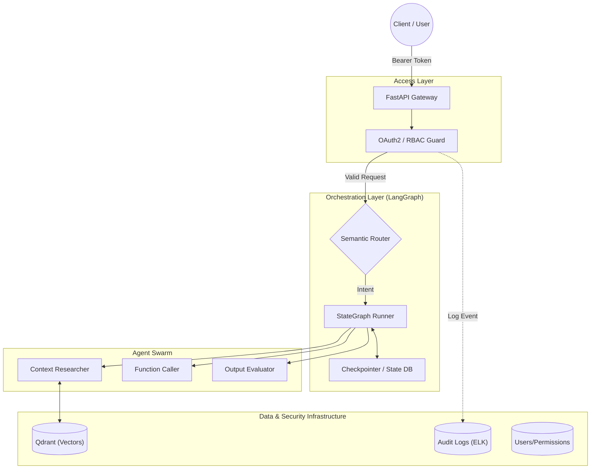

# 🛡️ Aegis-Isle: Enterprise Multi-Agent RAG Platform
### Next-Gen Knowledge Governance & Vertical Agent Orchestration

[](https://www.python.org/)
[](https://www.docker.com/)
[](https://langchain.com/)
[](https://qdrant.tech/)
[]()

> **"Bridging the Gap Between Enterprise Compliance and Adaptive AI Agents."**
>
> **Aegis-Isle** 是一个企业级多智能体协作平台。它采用 **Headless Backend (无头后端)** 架构，集成了 **LangGraph** 状态编排、**OAuth2/RBAC** 安全治理体系、以及 **Elasticsearch** 审计日志，为构建高可靠的垂直领域 AI 应用提供坚实底座。

---

## 🚀 Key Technical Highlights (核心技术亮点)

### 1. 🧬 Advanced Agent Orchestration (智能体编排)
- **LangGraph Integration**: 从线性工作流升级为**有向循环图 (StateGraph)** 架构，实现了复杂的循环逻辑（如：研究->反思->重写）和持久化状态管理。
- **Semantic Routing (语义路由)**: 基于 LLM 的意图识别路由器，动态分发任务至 Researcher, Analyst, 或 Coder 智能体，支持从关键字匹配自动降级。
- **Fault Tolerance (容错降级)**: 采用健壮的降级策略，确保系统在部分组件（如 LLM 路由）失败时自动回退至规则引擎，保障核心业务可用性。
- **Context Injection Middleware**: 设计并实现了上下文注入中间件，在严格保持 SillyTavern 角色人设（Persona-Keeping）的同时，无缝注入 RAG 知识库内容。

### 2. 🔐 Enterprise Governance & Security (企业级治理)
- **Fine-Grained RBAC**: 三层角色权限体系 (User/Admin/SuperAdmin)，支持细粒度的 API 访问控制。
- **Audit Logging**: 集成 **ELK-Stack** 兼容的结构化审计日志 (JSONL)，追踪每一次 Token 消耗、权限变更及敏感数据访问。
- **Security First**: 实现标准 **OAuth2 + JWT** 认证流程，Bcrypt 密码加密，以及请求级追踪 (Trace ID)。

### 3. 🧠 Hybrid RAG Engine (混合检索引擎)
- **Multi-Stage Retrieval**: 结合 **Dense Vector** (语义) 与 **BM25** (关键词) 的混合检索策略。
- **Vector Engine**: 集成 **FAISS** 向量数据库，实现文档检索和语义搜索（相关度阈值 > 0.34），精准过滤噪声。
- **Re-ranking**: 集成 Cross-Encoder 重排序模型，显著降低 "Lost in the Middle" 现象，提升长尾知识召回率。
- **Dynamic Ingestion**: 支持 PDF/MD/Image 实时解析与向量化，自动处理元数据注入。

### 4. ⚡ High-Performance Architecture (高性能架构)
- **Headless Backend**: 前后端完全解耦，通过 RESTful API 提供服务，完美支持 **SillyTavern** 等第三方客户端接入。
- **Streaming API**: 深度兼容 OpenAI 协议的 `/v1/chat/completions` 接口，支持 **SSE (Server-Sent Events)** 格式实时响应，实现流畅的打字机体验。
- **Dockerized**: 完整的容器化部署方案，包含 Prometheus + Grafana 监控预配置。

---

## 🏗️ System Architecture (系统架构)



---

## 🛠️ Tech Stack (技术栈)

- **Core Framework**: Python 3.11, FastAPI, Async/Await
- **AI Orchestration**: LangGraph, LangChain, OpenAI API
- **Vector Database**: FAISS, Qdrant
- **Security**: Python-JOSE (JWT), Passlib (Bcrypt)
- **Observability**: Structlog, Loguru, Promenade (Metrics)
- **Deployment**: Docker Compose, Shell Scripts

---

## 📸 Domain Application Showcase
*Aegis-Isle 不仅是底座，还孵化了垂直领域应用：*

### Project: Love & Code (Immersive Learning)
一个基于算法与角色扮演的沉浸式面试备考应用。
- **Features**: 艾宾浩斯遗忘曲线引擎、SillyTavern 角色卡适配器、ELI5 启发式教学。
- **Architecture**: 将复杂的 RAG 检索封装为具有"人格"的对话体验。


---

## 🚀 Quick Start

### Enterprise Backend (Docker)

```bash
# 1. Clone & Configure
git clone https://github.com/aegisisle/aegis-isle.git
cp .env.example .env

# 2. Start Services (API + VectorDB + Monitor)
docker-compose up -d --build

# 3. Access Swagger UI
# http://localhost:8000/docs
```

---

## 🔧 Deployment & Operations

详细部署文档请参考 [DEPLOYMENT.md](DEPLOYMENT.md)。

- **Health Check**: `GET /health`
- **Metrics**: `GET /metrics` (Prometheus format)
- **Auth Test**: `POST /api/v1/auth/token` (获取 Bearer Token)

---

## 🗺️ Roadmap

- [x] **v1.0**: Init RAG Engine & Vector Store.
- [x] **v1.5**: LangGraph Migration & Semantic Routing.
- [x] **v2.0**: Enterprise Security (RBAC, Audit Logs).
- [ ] **v2.1**: Async Task Queue (Celery/Redis).
- [ ] **v2.2**: Multi-Modal Input Support (Image/Audio).

---

<div align="center">
  <p>Engineered for Scalability, Designed for Intelligence.</p>
</div>
