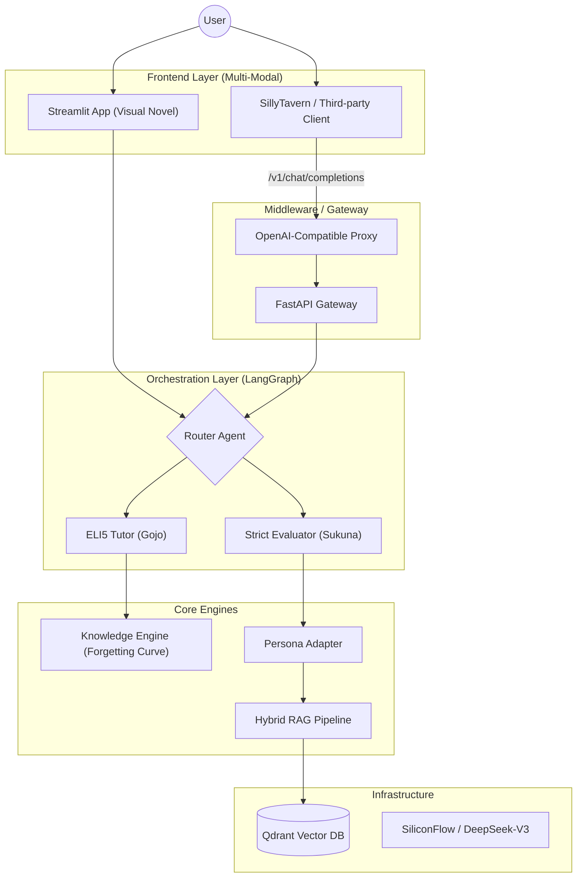

# 🛡️ Aegis-Isle: Multi-Agent RAG Ecosystem
### Enterprise Infrastructure & Immersive Vertical Applications

[](https://www.python.org/)
[](https://www.docker.com/)
[](https://langchain.com/)
[](https://qdrant.tech/)
[]()

> **"From Deep Enterprise Search to Immersive Career Companions."**
>
> **Aegis-Isle** 是一个模块化的多智能体协作平台。它不仅提供坚实的企业级 RAG 底座（权限控制、审计日志、容器化），更探索了垂直领域应用的边界——通过 **Project: Love & Code** 子系统，将面试备考转化为基于算法与角色扮演的沉浸式体验。

---

## 🏗️ System Architecture (系统架构)

本项目采用 **"Headless Backend" (无头后端)** 设计模式。底层 RAG 引擎与上层 UI 解耦，支持多种前端接入（Streamlit, Web API, 或第三方客户端如 SillyTavern）。



---

## 🌟 Core Modules (核心模块)

### 1. 🏢 Enterprise Core (企业级底座)
*坚实、安全、可扩展的基础设施。*
- **协作式 RAG**: 基于 **LangGraph** 的多智能体编排（Researcher, Analyst, Coder）。
- **混合检索增强**: 支持 PDF/MD/图片 OCR 解析，结合 **Hybrid Search (关键字+向量)** 与 **Re-ranking (重排序)** 技术，解决长尾知识召回问题。
- **安全架构**: 
  - **OAuth2 & RBAC**: 细粒度的角色访问控制与 JWT 令牌管理。
  - **Audit Logging**: ELK 兼容的结构化审计日志，追踪每一次 Token 消耗与 Agent 决策。
- **微服务部署**: 基于 Docker Compose 的松耦合架构，集成 Prometheus + Grafana 监控。

### 2. 💖 Vertical App: "Love & Code" (心动面试)
*基于 Streamlit 的沉浸式 Visual Novel 风格学习应用。*
- **Algorithmic Learning (算法驱动学习)**: 内置 **艾宾浩斯遗忘曲线** 引擎，通过 Leitner Box 模型动态管理题目熟练度，实现科学复习。
- **Persona Adapter (多模态角色适配)**: 独创的角色适配器，支持导入 **SillyTavern (酒馆)** V2 Spec 角色卡（PNG/JSON），将通用 LLM 转化为具备特定人格（如"毒舌面试官"或"温柔导师"）的垂直 Agent。
- **Dynamic Difficulty (动态难度)**: 基于 JD (岗位描述) 的语义分析，自动生成 Level 1-5 梯度的面试题。
- **ELI5 Tutoring**: 触发式教学模式，使用通俗比喻（Explain Like I'm 5）解析技术难点。

### 3. 🔌 Ecosystem: SillyTavern Proxy (酒馆中间件)
*实现 "Bring Your Own Client" (BYOC) 的生态扩展层。*
- **Context Injection Middleware**: 实现了一个兼容 OpenAI 协议的代理层。它拦截 SillyTavern 的请求，在后台静默执行 RAG 检索，将知识库中的技术文档注入到 Prompt 上下文中。
- **Value**: 允许用户在沉浸式 RPG 环境中与拥有专业知识库的 AI 角色互动（例如：让《博德之门3》的 Astarion 变成拥有 Python 专家知识的面试官）。

---

## 🧠 Algorithm & Deep Dive (算法与技术详解)

### 1. Spaced Repetition Engine (遗忘曲线引擎)
为了量化学习效果，我们在 `KnowledgeEngine` 中实现了确定性的复习算法 (Leitner System 改良版)。每道题目 $Q$ 的状态更新逻辑如下：

$$ NextInterval = 2^{Box} \times BaseInterval $$

- **状态转移:** 
    - 当用户答对：$Box \leftarrow \min(Box + 1, 5)$ (复习间隔指数级延长)
    - 当用户答错：$Box \leftarrow 0$ (立即重置进入急救队列)
- **应用:** 系统优先推送 `NextReview <= Now` 的题目，确保在记忆衰减临界点进行强化。

### 2. Hybrid RAG Pipeline (混合检索管道)
为了解决单一向量检索在专有名词（如 "DeepSeek", "LangGraph"）上召回率低的问题，我们采用了**混合检索策略**：

1.  **Dense Retrieval (稠密检索):** 使用 `all-MiniLM-L6-v2` 生成 Embedding，捕获语义相似度。
2.  **Keyword Search (关键词检索):** 集成 BM25 算法捕获精确匹配。
3.  **Re-ranking (重排序):** 使用 LLM 对检索回来的 Top-K 文档片段进行相关性打分，过滤掉 "Distractors" (干扰项)。

---

## 🧩 Prompt Engineering Strategy (Prompt 策略)

Aegis-Isle 摒弃了简单的 System Prompt 拼接，采用了 **"Three-Tier Context Injection" (三层上下文注入)** 技术，以确保 Persona（人设）与 Knowledge（知识）的完美融合。

```text
[Tier 1: System Persona (Immutable)]
"You are Ryomen Sukuna. Personality: Arrogant, Toxic, King of Curses..."
"Instruction: Always maintain this persona, even when explaining technical concepts."

[Tier 2: Knowledge Context (Dynamic RAG)]
"Relevant Technical Docs: 
 - [Chunk 1: Definition of RAG...]
 - [Chunk 2: Vector DB comparison...]"

[Tier 3: Task Instruction (Runtime)]
"User Answer: {input}. 
 Step 1: Fact-check the answer against Tier 2.
 Step 2: If wrong, mock the user based on Tier 1 persona.
 Step 3: Output strictly in JSON format: {is_correct, comment, reasoning}."
```

这种结构化设计确保了 LLM 在进行高强度角色扮演的同时，依然能准确遵循业务逻辑（如 JSON 输出），避免了 "Character Break"（OOC）问题。

---

## 📸 Demo Gallery (演示)

| **The Infrastructure** | **The Application** |
|:---:|:---:|
|  |  |
| *High-Performance RAG Pipeline* | *Immersive Persona-based Learning* |

---

## 🚀 Quick Start (快速运行)

### Prerequisites
- Docker 20.10+
- Python 3.10+
- SiliconFlow API Key

### Mode A: Run "Love & Code" App (Local)
适合直接体验面试与学习功能。

```bash
# 1. Setup Environment
python -m venv venv
source venv/bin/activate  # Windows: venv\Scripts\activate
pip install -r requirements.txt

# 2. Configure Credentials
# Create .env file with SILICONFLOW_API_KEY=...

# 3. Launch the Visual Novel Interface
streamlit run frontend/interview_app.py
```

### Mode B: Enterprise Backend (Docker)
启动完整的 API 服务和向量库。

```bash
docker-compose up -d --build
```

---

## 🔧 Troubleshooting (常见问题与运维)

**Q1: Streamlit 界面立绘加载失败？**
> 请检查 `assets/` 文件夹下是否存在 `sukuna.jpg` 等文件。如果使用网络图片，请确保网络环境能访问 Pinterest/Imgur。
> *Fix:* 在 `persona_manager.py` 中将 `avatar_url` 指向本地路径。

**Q2: Qdrant 连接报错 `ConnectionRefused`？**
> 如果在本地运行 Streamlit 而 Qdrant 跑在 Docker 里，请确保 `.env` 中的 `QDRANT_URL` 设置为 `http://localhost:6333` 而不是 Docker 内部 IP。

**Q3: LLM 响应速度慢？**
> 项目默认使用 SiliconFlow 的 DeepSeek-V3。如果遇到延迟，这是云端推理的正常现象。生产环境建议开启 `streaming=True` 选项（代码中已预留），以实现打字机效果，优化用户体验（TTFT）。

**Q4: 角色卡解析错误？**
> 目前仅支持 SillyTavern V2 Spec 的 PNG (含 `ccv3` 元数据) 或 JSON。旧版 V1 卡片请先在酒馆中转换。

---

## 🗺️ Roadmap (路线图)

我们致力于将 Aegis-Isle 打造成最灵活的 AI 知识伴侣。

- [x] **v1.0 (MVP):** 基础 RAG 引擎、多智能体编排、Visual Novel UI。
- [x] **v1.1 (Algo):** 遗忘曲线算法、SillyTavern 角色卡解析器 (PNG/JSON)。
- [ ] **v1.2 (Middleware):** 完善 **OpenAI-Compatible API Proxy**。
    - [ ] 全量支持 `/v1/chat/completions`。
    - [ ] 支持 Streaming Response (流式响应)。
- [ ] **v1.3 (Multi-modal):** 
    - [ ] **Voice:** 集成 OpenAI Whisper 实现语音模拟面试（ASMR 体验）。
    - [ ] **Vision:** 集成 Vision 模型，支持上传架构图手绘稿进行自动判卷。
- [ ] **v2.0 (SaaS):** 多用户支持与 PostgreSQL 持久化。

---

## 👩‍💻 About the Developer

**Gabriella**
*   **CS Master** | Full-Stack Developer | AI Enthusiast
*   **Tech Stack:** Python, FastAPI, LangChain, React, Docker.
*   **Focus:** Bridging the gap between **Rigorous Engineering** (RAG/Evaluations) and **Immersive Experiences** (Gaming/Role-play).
*   *Open to opportunities in AI Engineering & Application Development (Guangzhou/Shenzhen).*

---

<div align="center">
  <p>Powered by ❤️, ☕, and 咒力</p>
  <p>© 2024 Aegis-Isle Team. All rights reserved.</p>
</div>
```
