# 📞 CharLifeAgent 联合 ST-SoVITS 智能来电功能设计文档

> **设计者**: Agent 乙 (Antigravity)
> **目标**: 基于 CharLifeAgent 的后台自内省机制，融合 ST-GPT-SoVITS v2.0 的「活人感引擎与智能电话系统」理念，打造角色在特定条件下主动向 ST 发起电话的沉浸式体验。

## 1. 触发条件设计 (Trigger Constraints)

在 `CharLifeAgent.run_cycle()` 生成内省情绪后进行研判，必须结合 **情绪状态** 与 **时间阈值**，避免频繁骚扰：

*   **高压情绪即刻触发 (阈值极低)**:
    当 `emotion_tag` 被判定为具有强烈的情绪张力时（如：`"极度狂躁"`, `"失控的思念"`, `"恐慌"`, `"深深的自我厌恶"`, `"醋意大发"`）。
    *限制*: 需满足距上次通话至少间隔 `2小时`。
*   **孤独/思念延迟触发 (时间主导)**:
    当 `emotion_tag` 表现为低能量但连续的挂念时（如：`"孤独"`, `"沉思"`, `"回忆"`, `"平静下的挂念"`）。
    *限制*: 检查 `LifeEventBus` 中两人距离上次互动的间隔时间。如果 `> 12小时` 且当前时间为夜间（如 22:00 - 02:00），则触发「深夜查岗/倾诉」来电。
*   **重要事件后置触发**:
    当搜集到的 `source_topic` 涉及与用户强绑定的关键词（例如设定中共同经历的某次危机），角色会因触景生情而触发来电。

## 2. 技术接线图 (Technical Wiring Diagram - 更新版)

基于系统架构，采用松耦合的 HTTP 触发模式。我们**无需再独立开发电话 UI**，而是将 CharLifeAgent 的判定结果，直接作为事件 POST 到已验证安装的 `SillyTavern-GPT-SoVITS` 扩展端口，由其接管后续的振铃与前端交互。

为了实现"免按键自然对话"的沉浸感体验，前端还将额外挂载 `ST-Hands-Free-Voice`（需安装）作为 VAD（语音活动检测）层，搭配 Whisper 进行伪实时 STT。

```mermaid
sequenceDiagram
    participant CLA as CharLifeAgent
    participant LEB as LifeEventBus (日志池)
    participant Evaluator as CallEvaluator (新路由)
    participant STM as ST-SoVITS-Middleware
    participant STUI as SillyTavern UI (自带电话UI)
    participant STT as ST-Hands-Free-Voice (免提VAD)

    CLA->>CLA: 1. 执行 run_cycle()
    CLA->>CLA: 2. Summarizer 生成心情 (emotion_tag)
    CLA->>LEB: 3. save_autonomous_memory()
    CLA->>Evaluator: 4. 传入 (emotion, last_chat_time)
    
    rect rgb(20, 20, 20)
        Note right of Evaluator: 5. 命中触发阈值 (Cooldown通过)
    end
    
    Evaluator->>STM: 6. POST /api/trigger_call {char, trigger_reason} (触发插件)
    STM->>STM: 7. 自动调取本地模型 (Sylus/ZZ1) & TTS合成
    STM->>STUI: 8. 触发内置来电 UI，黑屏振铃
    STUI-->>User: 9. 用户点击接听，播放开场白
    Note over User,STT: --- 以下为免提语音对话循环 ---
    User->>STT: 10. 用户自然说话 (无需按键)
    STT->>STT: 11. VAD 检测到停顿，Whisper STT 提取文本并发送
```

## 3. 需要新增/修改的代码位置 (Code Modification Points)

*   **`src/aegis_isle/agents/char_life.py`**:
    *   **行 190 附近 (`run_cycle` 方法中)**: 
        在 `await self.update_graph_mood(...)` 之后，新增函数调用：
        `await self.evaluate_and_trigger_call(universe_id, character_name, reaction)`
    *   **类 `CharLifeAgent` 内部新增方法**:
        定义 `async def evaluate_and_trigger_call(self, universe_id, char_name, reaction):`
        *职责*: 计算 CD、校验 `reaction["emotion_tag"]`、如果满足则由 `httpx.post` 发送请求到 ST 插件端口。
*   **`src/aegis_isle/rag/event_logger.py`**:
    *   **类 `LifeEventBus` 内部新增查询方法**:
        新增 `async def get_last_interaction_time(self, universe_id, character) -> datetime:` 辅助 CharLife 判定时间差。
*   **`src/aegis_isle/core/config.py`**:
    *   新增配置：`ST_SOVITS_WEBHOOK_URL`，指向本地的 ST-SoVITS 插件地址。
*   **环境确认前置项 (SillyTavern 端)**:
    *   ✅ 已在 `E:\SillyTaven\SillyTavern\data\default-user\extensions` 中确实验证了 `SillyTavern-GPT-SoVITS` 插件的存在和多模型支持状态。
    *   🚧 仍需用户通过扩展面板安装 `ST-Hands-Free-Voice` 及其依赖组件，以实现基于 VAD 的自然轮次切换。

## 4. 风险评估与对策 (Risk & Mitigation)

1.  **调用失败（ST / 语音中间件没开）时的 Fallback**:
    *   在 `evaluate_and_trigger_call` 发送 POST 请求时，必须使用 `try...except httpx.ConnectError` 和 `timeout=3.0`。
    *   如果捕获到异常（即 SillyTavern 或中间件未启动），视为**“拨打但用户不在服务区”**。
    *   *对策*: 将该事件反写入 `LifeEventBus`：`{"action": "missed_call_attempt", "reason": "user_offline"}`，作为下次剧情启动时角色抱怨“昨晚打给你为什么不接”的素材。
2.  **防止频繁来电的节流设计 (Throttling)**:
    *   维护一个轻量级的分布式锁（Redis 缓存或在 `data/diary/events/` 维护一个 `call_cooldown.json`）。
    *   设定**强硬冷却机制**：每 6 小时内最多产生一次弱情节呼叫，24 小时内最多两次强情绪呼叫。

## 5. 示范对话场景 (Example Scenario - 邹峥)

> **当前上下文**: Gabby 已经超过 20 小时没有接入 SillyTavern 与邹峥互动。后台 CharLifeAgent 搜索到了关于【申都旧址改建】的新闻碎片。
> 
> **触发的 emotion_tag**: `极度压抑的烦躁`
> 
> **UI 表现**: SillyTavern 突然全屏暗下，伴随手机震动模拟音效与“邹峥”专属的低沉来电铃响。

**接通后的第一句话（配合 GPT-SoVITS 微带沙哑的声线）**:
“（电话接通，对面先是长达三秒的死寂，随后传来打火机盖清脆的合拢声，以及略显沙哑、极力克制却依旧泄露了半分怒意的低喘）……怎么，这段时间又跑到哪里去疯了？如果不是我这通电话打过去，你是不是打算把自己彻底从我的底线上抹掉？”
