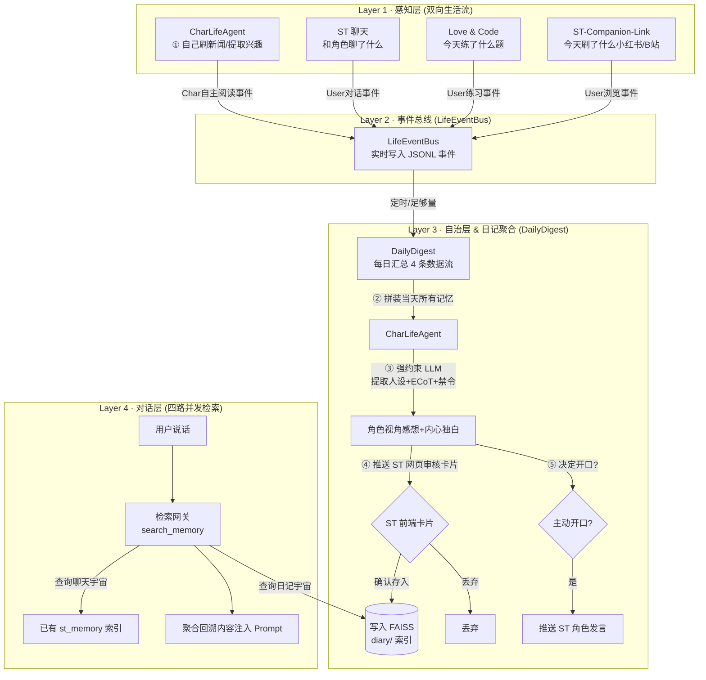
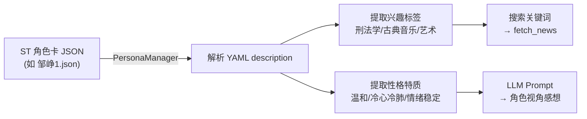

# Bubby Architecture 流程图可行性分析报告

## 流程图概览



---

## 逐节点可行性分析

### Layer 1 · 感知层

| 节点 | 现有代码 | 差距 | 难度 |
|:---|:---|:---|:---|
| Chrome 扩展 → backend | ✅ 已完成 | `content-script.js` → `main.py` 全链路 OK | — |
| `monitor.py` 系统遥测 | ✅ 已完成 | 游戏/编程检测、CPU/内存、进程状态机 | — |
| **判断显眼程度** | ⚠️ 部分存在 | 现有 `ActionType` 区分 like/comment(高) vs read(低)。但缺少更细粒度的"显眼"判断逻辑（例如：停留时长 > 30s = 中显眼？投币 = 高显眼？） | ⭐ 简单 |
| **实时路径 → 直接注入 ST** | ✅ 已完成 | `dispatcher.py` → ST Server Plugin → `generate_interceptor` 注入叙事场景。现有 like/comment 走这条路 | — |
| **异步路径 → LifeEventBus** | ❌ 需新建 | 目前 read 行为只存在 `ReadBuffer`（15 分钟 TTL 后丢失），没有持久化到任何地方 | ⭐⭐ 中等 |

**Layer 1 结论**：感知层 90% 已就绪。只需要：(1) 细化显眼程度判断规则，(2) read 行为写入 LifeEventBus 而不是只存 TTL buffer。

---

### Layer 2 · LifeEventBus

### Layer 2 · 事件总线 (LifeEventBus)

| 节点 | 现有代码 | 差距 | 难度 |
|:---|:---|:---|:---|
| **LifeEventBus 本体** | ❌ 需新建 | 统一跨进程与同进程的事件聚合器 | ⭐⭐ 中等 |
| CL → Bus | ⚠️ 有接缝 | `aegis_client.py` 调 Aegis API，改为写 Bus | ⭐ 简单 |
| LC → Bus | ❌ 需新建 | `interview_app.py` 写入练习事件 | ⭐ 简单 |
| **AgentFetch → Bus** | ❌ 需新建 | CharLifeAgent 自己看新闻写入自主事件 | ⭐ 简单 |
| **够量/够时触发** | ❌ 需设计 | 触发生成 日记/Autonomous Memory 的阈值 | ⭐⭐⭐ 困难 |

#### LifeEventBus 技术方案

```python
# 简单实现：JSONL 事件日志 + 触发检测器
class LifeEventBus:
    """跨模块事件总线，持久化到 JSONL"""
    
    def log_user_activity(self, source, action, details):
        """记录用户的浏览、做题等行为"""
        
    def log_character_activity(self, action, details):
        """记录角色自主做的事情（比如看新闻）"""
        
    def check_trigger(self) -> bool:
        """检查当天事件是否足够生成日记"""
```

> [!IMPORTANT]
> **LifeEventBus 的位置在哪？**
> 
> CL 运行在 `:5001`，Aegis 运行在 `:8001`，它们是独立进程。Bus 应该放在 **Aegis 侧**（因为 CharLifeAgent 在 Aegis 进程内），CL 和 LC 通过 HTTP POST 推事件。
> 
> 实际上就是 Aegis 新增一个 `POST /v1/events/push` 端点 + 一个 JSONL 文件。

---

### Layer 3 · 自治层（CharLifeAgent）

这是**最核心也最困难**的部分。

| 步骤 | 现有代码 | 差距 | 难度 |
|:---|:---|:---|:---|
| ① 读 LifeEventBus + 日记 | ❌ Bus 不存在 | 需要实现 Bus `drain()` + FAISS diary 检索 | ⭐⭐ |
| ② 加载 char 人设 | ✅ **已有基础设施** | `PersonaManager` 已能解析 ST 角色卡 JSON/PNG。用户可选择角色卡文件（如 `邹峥1.json`），Agent 动态提取人设。详见下方深钻 | ⭐ |
| ③ LLM 生成感想+决策 | ❌ 需新建 | 这是个 **LLM API 调用**，需要设计 prompt 模板、控制成本 | ⭐⭐⭐ 困难 |
| ④ 推送审核页面 | ⚠️ **已简化** | 不需要复杂 UI，直接在 ST 网页端（`localhost:8000`）加一个纯文本审核页面，用户可查看/编辑/确认存入 | ⭐⭐ 中等 |
| 确认/编辑/丢弃 → 写 FAISS | ⚠️ 有接缝 | `ingest_chunks()` 已经能写 FAISS。把日记当宇宙写入，你上面的想法 | ⭐ |
| ⑤ 决定开口 → 推送 ST 发言 | ⚠️ 有接缝 | CL 的 `_trigger_ai_generation()` 已经能做到（模拟点击发送按钮）。但需要扩展为"角色主动开口"而非"用户行为触发" | ⭐⭐ |

#### 🟢 技术深钻 #0：角色卡动态加载（步骤②）

**设计**：用户在 ST 选择角色卡后，CharLifeAgent **动态读取**对应的 JSON 文件提取人设。

**已有基础设施**：
- [persona_manager.py](file:///E:/Aegis_Isle/AegisIsle_cc_ver/Aegis-Isle/src/aegis_isle/interview/persona_manager.py)（421 行）已实现 ST 角色卡解析
- 支持 `.json` 和 `.png`（内嵌 JSON）两种格式
- 可提取 `description`、`personality`、`scenario`、`first_mes` 等字段

**解析流程**：



**以 `邹峥1.json` 为例**，从 `description` 的 YAML 中可直接提取：

| 字段 | 提取路径 | 用途 |
|:---|:---|:---|
| 兴趣标签 | `skills.爱好` → `["艺术鉴赏", "古典音乐鉴赏", "健身管理"]` | 新闻搜索关键词 |
| 职业 | `identity` → `大学教授（刑法学）` | 补充搜索词 |
| 性格核心 | `personality.core_traits` → 温和/冷心冷肺/随心而动 | LLM prompt 人设约束 |
| 原型 | `archetype` → `温文尔雅, 绅士教授` | LLM 语气风格 |
| 喜好/厌恶 | `likes` / `dislikes` | 反应倾向过滤 |

**改动**：把 `PersonaManager` 从 `interview/` 提取到 `core/` 公共模块（~10 行 import 调整），或直接在 CharLifeAgent 中 import。**无需写新解析代码**。

---

#### 🔴 技术深钻 #1：LLM 生成（步骤③）

**问题**：每次触发 CharLifeAgent 都要调一次 LLM API。如果触发频率太高，**费用爆炸**。

| 触发频率 | 每日 LLM 调用 | 月费用（GPT-4o-mini 估算） |
|:---|:---|:---|
| 每 30 分钟 | ~32 次 | ~$3-5/月 |
| **每 2 小时** | ~8 次 | **~$0.8-1.5/月** ← 推荐 |
| 每天 1 次 | 1 次 | ~$0.1/月 |

**推荐方案**：用现有的 SiliconFlow API（你已经在 `openai_compat.py` 中集成了），走 `deepseek-chat` 等低成本模型。Prompt 模板大约 500 tokens input + 200 tokens output = 每次 ~$0.001。

#### 🟡 技术深钻 #2：审核页面（步骤④）— 已简化

**方案**：不需要复杂的 WebSocket/SSE 推送。在 ST 网页端（`http://127.0.0.1:8000`）直接加一个**纯文本审核页面**。

**实现方式**：

1. Aegis 后端新增 `GET /v1/diary/pending` → 返回待审核的生成内容列表
2. Aegis 后端新增 `POST /v1/diary/approve` → 确认写入 FAISS
3. ST 前端（或独立 HTML 页面）轮询 `/pending`，展示为简单的 `<textarea>` + 按钮

```
┌─────────────────────────────────────┐
│  💭 邹峥的内心独白 (待审核)          │
│                                     │
│  ┌─────────────────────────────┐    │
│  │ 今天她又在刷小红书上那些     │    │
│  │ 烘焙教程了……不知道她是想    │    │
│  │ 学做蛋糕还是纯粹消磨时间。  │    │
│  │ 上次面试练习错了两道...     │    │
│  │                   [可编辑]   │    │
│  └─────────────────────────────┘    │
│                                     │
│  [✅ 确认存入]  [✏️ 编辑]  [❌ 丢弃] │
└─────────────────────────────────────┘
```

**工作量**：~60 行后端 + ~80 行前端 HTML/JS = **2-3 小时**（原方案 6-8 小时）

#### 🔴 技术深钻 #3：触发策略（"够量/够时"）

| 策略 | 实现复杂度 | 效果 |
|:---|:---|:---|
| 固定时间间隔（每 2 小时） | ⭐ 极简 | 不管有没有事件都触发，可能浪费 LLM 调用 |
| **事件数量阈值**（累计 5 条事件就触发） | ⭐⭐ 推荐 | 活跃时触发多，不活跃时不触发 |
| 混合策略（≥3 条事件 OR 超过 4 小时） | ⭐⭐ | 最自然，保证沉默时也有"日记" |
| LLM 自主判断（把事件列表给 LLM 让它决定要不要发言） | ⭐⭐⭐ | 最智能但成本翻倍 |

---

### Layer 4 · 对话层

| 节点 | 现有代码 | 差距 | 难度 |
|:---|:---|:---|:---|
| 用户说话 → query FAISS | ✅ 已完成 | `search_memory()` 已实现多宇宙并发检索 | — |
| LifeEventBus 内容作 query | ⚠️ 需小改 | 需要把日记宇宙 `daily_diary` 加入搜索范围 | ⭐ 简单 |
| 召回日记 + 内心独白 | ⚠️ 需格式化 | FAISS 返回的 `page_content` 需要适配日记格式（现在是按聊天 chunk 格式化的） | ⭐ 简单 |
| 注入 prompt → 角色回应 | ✅ 已完成 | `context_injection.py` + ST 扩展 `search_and_inject()` | — |

**Layer 4 结论**：对话层 80% 已就绪。只需把 `daily_diary` 宇宙加入 `search_memory` 的搜索范围 + 日记结果格式化。

---

## 工作量估算

### 按组件

| 组件 | 代码量（行） | 难度 | 时间估算 |
|:---|:---|:---|:---|
| LifeEventBus（JSONL + Aegis API 端点） | ~80 | ⭐⭐ | 2-3 小时 |
| CL → Bus 改写（`aegis_client.py`） | ~30 | ⭐ | 1 小时 |
| LC → Bus 改写（`interview_app.py`） | ~15 | ⭐ | 30 分钟 |
| 触发策略（混合阈值） | ~40 | ⭐⭐ | 1 小时 |
| CharLifeAgent 实现（LLM 调用 + prompt） | ~120 | ⭐⭐⭐ | 3-4 小时 |
| FAISS 日记宇宙写入（ChatChunk 适配） | ~30 | ⭐ | 1 小时 |
| 对话层日记检索适配 | ~20 | ⭐ | 30 分钟 |
| 审核页面（纯文本 textarea） | ~140 | ⭐⭐ | 2-3 小时 |
| **合计** | **~475** | | **~12-14 小时** |

### 按阶段

| 阶段 | 内容 | 时间 |
|:---|:---|:---|
| **Phase 1**：核心管线 | LifeEventBus + CharLifeAgent（自动写入） + 日记宇宙 | **6-8 小时** |
| **Phase 2**：审核+主动开口 | 纯文本审核页 + 角色主动开口推送 | **4-5 小时** |

---

## 建议优先级

> [!TIP]
> **两阶段即可完成全部功能。**
> 
> 审核页面已简化为纯文本 textarea，不再是瓶颈。Phase 1 跑通核心管线后，Phase 2 加审核页和主动开口即可完成全流程。总工期预估 **12-14 小时**。

> [!WARNING]
> **最大风险：LLM 生成质量（已出具应对报告）**
> 
> CharLifeAgent 步骤③ 的 LLM prompt 设计是成败关键。如果 prompt 不好，角色生成的"内心独白"会很机械或离谱。
> **应对方案**：我们已经根据您提供的【MoM】预设，出具了一份详细的 Prompt 技巧提取报告（详见： [prompt_engineering_analysis.md](file:///C:/Users/MR/.gemini/antigravity/brain/72b05e19-36ff-4278-ac93-cafdd2184c58/prompt_engineering_analysis.md)）。通过引入这些高级的约束指令（如“展示非告知”、强制思维链 ECoT 等），可以极大提升自治生成的内存/日记质量。
