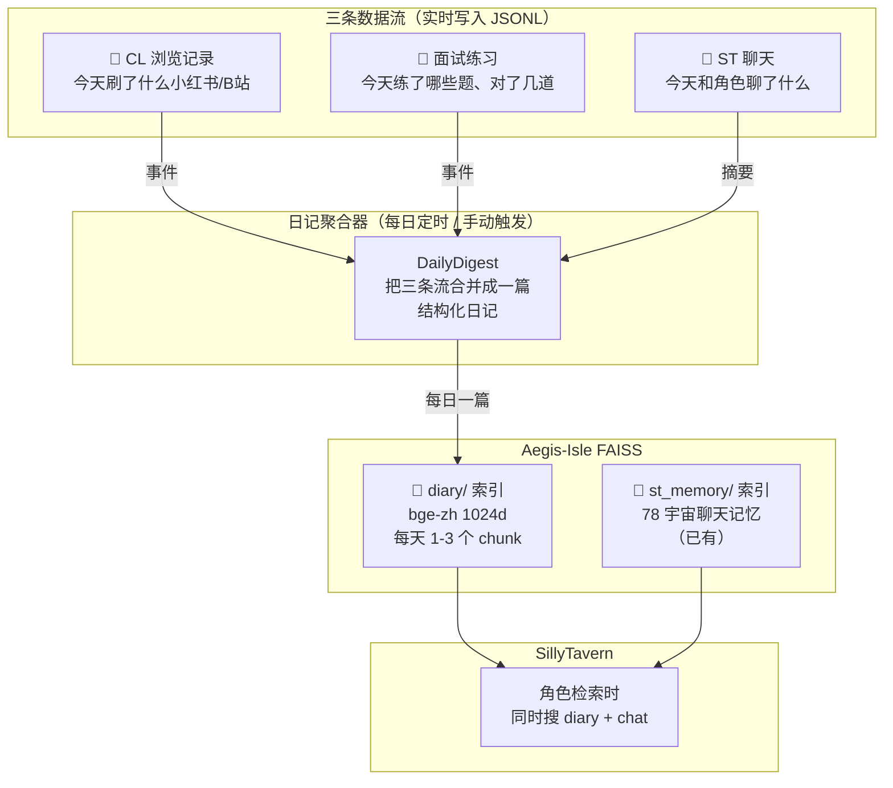

# 多项目集成方案 v6：统一日记系统

## 核心概念

**不是把零散数据塞进 FAISS，而是把三条数据流汇聚成一本"日记"，日记才是进 FAISS 的东西。**



---

## 日记长什么样？

```markdown
# 2026-03-07 周四日记

## 📱 今日浏览
- [like] 小红书《秋冬穿搭｜今年的大衣怎么选？》 #穿搭 #大衣
- [read] B站 UP主xxx《Transformer从零实现》看到 15:30/45:00
- [comment] 小红书 评论了"这个颜色绝了！"

## 📝 面试练习
- 今日练习 5 题，正确 3 题 (60%)
- 薄弱领域：attention_mechanisms (0/2)
- 掌握领域：api_design (2/2)
- 遗忘曲线进度：3 题升入 Box2

## 💬 角色互动摘要
- 和「七海」聊了 React 面试技巧
- 和「五条」讨论了 RAG 系统设计
```

**一天 ≈ 300-800 字 ≈ 1-2 个 chunk**  
**一个月 ≈ 30-60 个 chunk** → 非常适合 FAISS  
**半年 ≈ 180-360 个 chunk** → BGE-zh 检索效果最佳的量级

---

## 数据流细节

### 实时层：三条 JSONL 事件流

```
data/diary/
├── events/
│   ├── browsing.jsonl    ← CL 每次 like/comment/read 追加一行
│   ├── interview.jsonl   ← 面试系统每次答题追加一行
│   └── chat_summary.jsonl ← Aegis 每次 ingest 后追加摘要
└── digests/
    ├── 2026-03-07.md     ← 聚合后的日记原文
    └── 2026-03-08.md
```

### 聚合层：DailyDigest

- **触发时机**：每日凌晨自动 / 用户手动 / Aegis 关闭时
- **流程**：读取当天三个 JSONL → 生成结构化日记 → BGE-zh 嵌入 → 写入 `diary/` FAISS 索引
- 不需要 LLM 参与，纯模板拼接（快、稳、无 API 成本）

### 检索层：四路并发

```python
# search_memory 修改
results = await asyncio.gather(
    search_chat_faiss(query, universes),   # ① 聊天记忆（已有）
    search_diary_faiss(query, k=3),        # ② 日记检索（新增）
    search_graph(query),                    # ③ 占位
    search_episode(query),                  # ④ 占位
)
```

角色就能自然地引用：
- "你上周三练面试的时候 attention 那块不太行，要不再来一道？"
- "你昨天在小红书上看了好多穿搭，是不是要面试想搞一身行头？"

---

## Proposed Changes

### [NEW] [daily_digest.py](file:///E:/Aegis_Isle/AegisIsle_cc_ver/Aegis-Isle/src/aegis_isle/rag/daily_digest.py) (~120行)

```python
class DailyDigest:
    """汇聚三条数据流，生成每日日记并写入 FAISS"""
    
    def collect_events(self, date: str) -> DiaryEntry:
        """读取当天三个 JSONL，拼成日记"""
    
    def compile_and_index(self, date: str):
        """生成日记文本 → BGE-zh 嵌入 → 追加到 diary FAISS"""
    
    def search(self, query: str, k=3):
        """语义检索日记"""
```

### [NEW] [event_logger.py](file:///E:/Aegis_Isle/AegisIsle_cc_ver/Aegis-Isle/src/aegis_isle/rag/event_logger.py) (~50行)

```python
class EventLogger:
    """统一事件记录器，所有数据源共用"""
    
    def log_browsing(self, action, title, tags, url, platform): ...
    def log_interview(self, question, correct, category, tags): ...
    def log_chat_summary(self, character, summary): ...
```

### [MODIFY] [memory.py](file:///E:/Aegis_Isle/AegisIsle_cc_ver/Aegis-Isle/src/aegis_isle/api/routers/memory.py) (+40行)

- `POST /v1/diary/event` — CL / 面试系统写入事件
- `POST /v1/diary/compile` — 手动触发日记编译
- `search_memory` 增加日记检索路

### [MODIFY] [aegis_client.py](file:///E:/ST-Companion-Link/backend/aegis_client.py) (~25行重写)

改为 POST 到 `/v1/diary/event`。

### [MODIFY] [interview_app.py](file:///E:/Aegis_Isle/AegisIsle_cc_ver/Aegis-Isle/frontend/interview_app.py) (+10行)

`submit_answer()` 后 POST 到 `/v1/diary/event`。

### [MODIFY] [st_memory_manager.py](file:///E:/Aegis_Isle/AegisIsle_cc_ver/Aegis-Isle/src/aegis_isle/rag/st_memory_manager.py) (+5行)

`ingest_chat` 完成后，自动写一行 chat_summary 事件。

---

## 改动汇总

| 项目 | 文件 | 操作 | 行数 |
|:---|:---|:---|:---|
| Aegis | `rag/daily_digest.py` | **新建** | ~120 |
| Aegis | `rag/event_logger.py` | **新建** | ~50 |
| Aegis | `api/routers/memory.py` | 修改 | +40 |
| Aegis | `rag/st_memory_manager.py` | 修改 | +5 |
| Aegis | `frontend/interview_app.py` | 修改 | +10 |
| CL | `backend/aegis_client.py` | 重写 | ~25 |
| **总计** | | | **~250 行** |

---

## 面试时怎么讲这个

> "我设计了一个**多源日记聚合系统**：用户每天的浏览行为、面试练习、角色对话三条数据流实时写入 JSONL 事件日志，每日聚合成结构化日记后通过 BGE-zh 嵌入写入专用 FAISS 索引。AI 角色在对话时会并发检索聊天记忆和日记两个索引，实现跨时间、跨场景的长期记忆回溯。"

技术亮点：
- **事件溯源模式**（Event Sourcing）：JSONL 是不可变事件流，日记是投影
- **多源聚合**：三条异构数据流 → 统一日记格式
- **增量索引**：每天只编译新日记，不需要全量重建
- **跨进程容错**：CL/面试系统写事件失败不影响主流程
